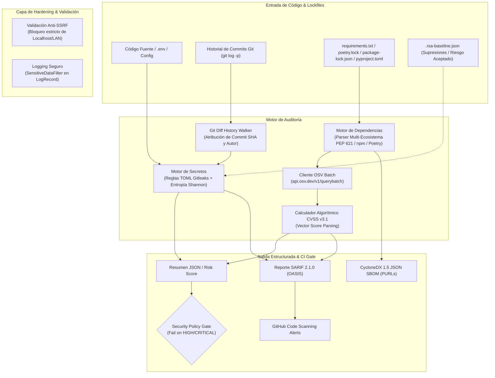

# Repo Secret & Dependency Auditor

[](https://www.python.org/)
[](https://pypi.org/project/pip-audit/)
[](tests/)
[](https://sarifweb.azurewebsites.net/)
[](https://cyclonedx.org/)
[](https://docs.github.com/en/code-security/code-scanning)
[](LICENSE)

Backend de escaneo estático de seguridad de código abierto diseñado para auditar repositorios en pipelines de CI/CD: detección de secretos de alta fidelidad (compatible con reglas Gitleaks TOML), escaneo de historial de commits pasados (`--history`), análisis de vulnerabilidades en dependencias mediante Google OSV Batch API, supresiones estructuradas con `.rsa-baseline.json`, exportación de SBOM en **CycloneDX 1.5 JSON** y exportación en formato estándar **SARIF 2.1.0** para integración nativa con **GitHub Code Scanning Alerts**.

---

## 🏛️ Arquitectura del Sistema



---

## ✨ Capacidades Clave

### 1. Detección de Secretos y Escaneo Histórico
- **Escaneo Profundo de Commits (`--history`)**: Analiza la historia completa del repositorio (`git log -p`), detectando credenciales que fueron introducidas y posteriormente "borradas" en commits subsecuentes, extrayendo el SHA, fecha y autor.
- **Motor basado en TOML (compatible con Gitleaks)**: Carga y compila reglas estandarizadas desde [`src/app/scanner/rules.toml`](src/app/scanner/rules.toml).
- **Catálogo de reglas curadas**:
  - Claves privadas (RSA, OpenSSH, EC, PGP, DSA).
  - AWS Access Keys (`AKIA...`) y AWS Secret Access Keys (40 caracteres).
  - Google Cloud Platform API Keys (`AIza...`).
  - Slack Bot / User Tokens (`xoxb-`, `xoxp-`, `xoxa-`, `xoxr-`).
  - Stripe API Live/Test Keys (`sk_live_`, `rk_live_`).
  - OpenAI / Anthropic API Keys (`sk-`, `sk-proj-`).
  - JSON Web Tokens (JWT) y Bearer tokens.
  - GitHub PATs clásicos y Fine-Grained (`ghp_`, `github_pat_`, etc.).
- **Mecanismo de Línea Base (`.rsa-baseline.json`)**: Permite registrar hallazgos conocidos o riesgos aceptados con hash de evidencia y fecha de expiración opcional para no romper el pipeline de CI.
- **Filtro de Entropía de Shannon**: Análisis de aleatoriedad por juego de caracteres para descartar tokens triviales.
- **Filtrado de placeholders**: Ignora de forma automática ejemplos y variables de documentación (`EXAMPLE`, `PLACEHOLDER`, `YOUR_KEY`, `DUMMY`).
- **Zero-Knowledge Evidence**: Los secretos nunca se imprimen en texto plano en reportes SARIF ni logs; se genera un hash SHA-256 no reversible como identificador de evidencia.

### 2. Auditoría de Dependencias y Exportación SBOM
- **Soporte de Lockfiles Modernos**:
  - Python: `requirements.txt`, `pyproject.toml` (PEP 621) y `poetry.lock` (formato TOML).
  - Node.js: `package-lock.json` (formatos v1, v2 y v3 con árboles anidados).
- **Exportador CycloneDX 1.5 JSON SBOM**: Genera el inventario formal de componentes de software con Package URLs (PURL) estándar (`pkg:pypi/...`, `pkg:npm/...`).
- **Consultas por Lotes en Google OSV (`/v1/querybatch`)**: Una sola petición HTTP resuelve paquetes concurrentemente en < 1.5s.
- **Parser Algorítmico CVSS v3.1**: Calcula matemáticamente el score base a partir del vector CVSS de OSV (ej. `CVSS:3.1/AV:N/AC:L/PR:N/UI:N/S:U/C:H/I:H/A:H` $\to$ `9.8 CRITICAL`), previniendo degradaciones accidentales de severidad.

### 3. Hardening y Seguridad Defensiva
- **Mitigación Estricta de SSRF**: Lista blanca restringida a hosts Git públicos autorizados (`github.com`, `gitlab.com`, `bitbucket.org`, `gitea.io`). Rechazo explícito de `localhost`, `127.0.0.1`, IPs de metadata cloud (`169.254.169.254`) y esquemas no seguros (`git://`, `http://`).
- **Prevención de Inyección de Argumentos Git**: Validación de `ref` contra caracteres de opciones (`-`).
- **Filtro de Logging de Datos Sensibles**: `SensitiveDataFilter` integrado en `logging.Handler` que censura automáticamente el mensaje formateado y `*args`.

---

## 🚀 Inicio Rápido

### Requisitos
- Python 3.12+ (compatible con Python 3.13 y 3.14).

### Instalación Local
```bash
# Clonar repositorio
git clone https://github.com/h3n-x/repo-secret-auditor.git
cd repo-secret-auditor

# Crear y activar entorno virtual
python3 -m venv .venv
source .venv/bin/activate

# Instalar paquete en modo editable con herramientas de desarrollo
pip install --upgrade pip
pip install -e ".[dev]"
```

### Ejecutar Escaneo desde CLI
```bash
# Escaneo de directorio con SARIF, CycloneDX SBOM y escaneo de historial
rsa --project-root . \
    --summary artifacts/summary.json \
    --sarif artifacts/findings.sarif \
    --sbom artifacts/bom.json \
    --history \
    --fail-on high
```

---

## 🛡️ Integración en GitHub Actions

Puedes invocar directamente el workflow reutilizable en cualquier repositorio para escanear pull requests y publicar alertas automáticas en la pestaña de **Security > Code scanning alerts**:

```yaml
name: Security Audit Pipeline

on:
  pull_request:
    branches: [main]
  push:
    branches: [main]

jobs:
  audit:
    uses: h3n-x/repo-secret-auditor/.github/workflows/reusable-security-scan.yml@main
    permissions:
      contents: read
      security-events: write
    with:
      fail-on-severity: true
      summary-json-path: artifacts/summary.json
      sarif-path: artifacts/findings.sarif
    secrets:
      github-token: ${{ secrets.GITHUB_TOKEN }}
```

---

## 🧪 Pruebas y Aseguramiento de Calidad

```bash
# Ejecutar suite de pruebas completa con reporte de cobertura
pytest tests/ --cov=src --cov-fail-under=85

# Verificar estilo y reglas estáticas con Ruff
ruff check .

# Validar tipado estricto con Mypy
mypy src tests

# Auditar dependencias contra la base de datos de CVEs
pip-audit
```

---

## 📊 Matriz de Detección de Secretos

| Tipo de Secreto | Patrón / Formato | Severidad | Entropía Min |
| :--- | :--- | :--- | :--- |
| **AWS Secret Access Key** | 40 caracteres base64 (`[A-Za-z0-9/+=]{40}`) | Critical | 3.5 |
| **Claves Privadas** | `-----BEGIN (RSA\|EC\|OPENSSH\|PGP) PRIVATE KEY-----` | Critical | 0.0 |
| **GitHub PAT** | `ghp_...`, `github_pat_...`, `ghu_...` | High | 3.3 |
| **GCP API Key** | `AIza[0-9A-Za-z\-_]{35}` | High | 3.2 |
| **Slack Token** | `xoxb-...`, `xoxp-...`, `xoxa-...` | High | 2.8 |
| **Stripe API Key** | `sk_live_...`, `rk_live_...` | High | 3.0 |
| **OpenAI API Key** | `sk-...`, `sk-proj-...` | High | 3.5 |
| **JSON Web Token** | `ey...ey...` (3 segmentos base64url) | Medium | 3.5 |
| **Generic API Key** | Tokens de alta entropía asignados a variables clave | Medium | 3.5 |

---

## 📄 Licencia

Distribuido bajo la Licencia MIT. Consulta `LICENSE` para más información.
